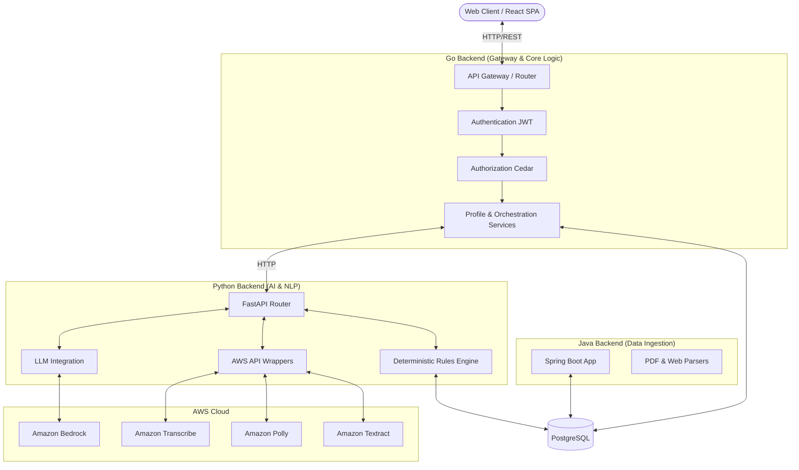
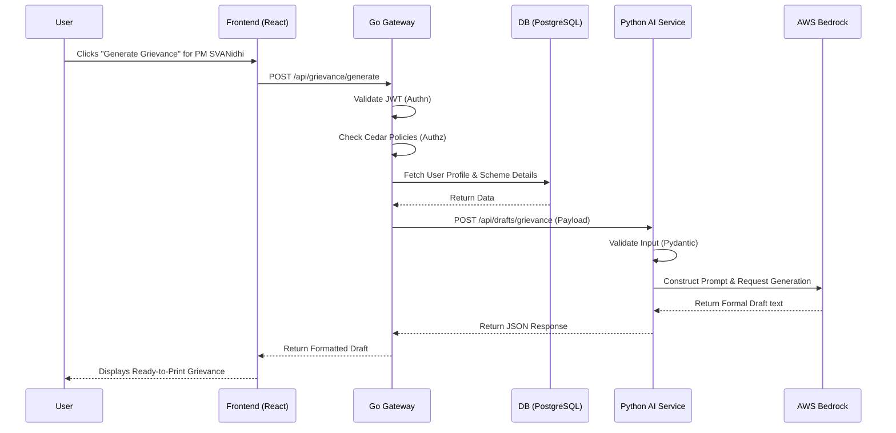
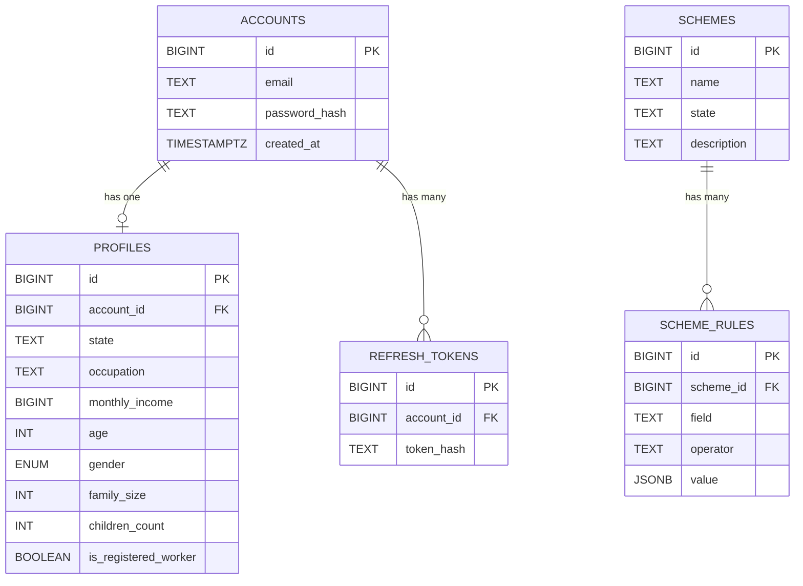

# Sahayak – GovScheme Navigator

Sahayak is an AI-powered **Government Scheme Navigator** designed to make government welfare schemes transparent, discoverable, and easily accessible.

It bridges the digital divide for daily-wage workers, street vendors, farmers, and other digitally underserved citizens by providing a voice-first, multilingual, and AI-assisted platform to discover eligibility, understand requirements, and automatically generate official grievances or applications.

---

## 1. Problem Statement & Why Sahayak

### The Challenge
Navigating government welfare systems is difficult. For the underserved, discovering which schemes they qualify for is often hindered by:
- **Language Barriers**: Official documents use formal, complex language.
- **Digital Literacy**: Complex forms and deep nested portals are inaccessible to those unaccustomed to digital navigation.
- **Complex Eligibility**: Determining eligibility often involves cross-referencing age, caste, income, occupation, and family size against rigid rules.
- **Application Friction**: Knowing how to apply or where to file a grievance when a scheme is denied is a massive hurdle.

### How Sahayak Solves It
Sahayak provides a guided, intelligent solution:
1. **Multilingual & Voice-First**: Citizens can interact with the platform using text or voice in Hindi, English, or Hinglish (powered by AWS Transcribe and Polly).
2. **AI-Assisted Profile Building**: Users describe their situation naturally, and AI extracts structured profile data (age, income, occupation).
3. **Deterministic Eligibility**: Instead of trusting an LLM to guess eligibility, a robust, deterministic rules engine accurately matches citizens to schemes.
4. **Automated Grievances**: AI drafts formal grievance letters and applications tailored to the exact scheme and user context, removing the intimidation of bureaucratic writing.

---

## 2. Key Features

- **Dynamic Scheme Discovery**: Explore schemes categorized by livelihood, healthcare, housing, and more.
- **Smart Eligibility Engine**: A rigorous rule-based system that ensures 100% deterministic accuracy on whether a user is eligible, ineligible, or needs to provide more info.
- **AI-Powered Form Filling & Grievance Generation**: Generates perfectly formatted official documents using AWS Bedrock, heavily grounded by the user's profile and scheme rules to prevent hallucination.
- **Voice Interactions**: Speak naturally to the system to fill out forms and search for schemes.
- **Document OCR**: Extract data from official documents using AWS Textract.
- **Role-Based Authorization**: Fine-grained access control ensuring citizens can only view and modify their own data.

---

## 3. Architecture Overview

Sahayak employs a robust microservices architecture leveraging Go, Python (FastAPI), Java (Spring Boot), React, and AWS Services.

### Service Architecture



### Main User Workflow: Grievance Generation



---

## 4. Technology Stack

| Layer | Technology | Purpose |
| :--- | :--- | :--- |
| **Frontend** | React, Vite, TypeScript | Fast, responsive single-page application |
| **API Gateway** | Go 1.21+, Gorilla Mux | Core business logic, orchestration, high-throughput routing |
| **AI & NLP Backend** | Python, FastAPI, Pydantic | AI interactions, speech processing, and deterministic rule evaluation |
| **Ingestion Backend** | Java, Spring Boot, PDFBox | Parsing PDFs and webpages to automatically ingest schemes |
| **Database** | PostgreSQL 17 | Primary relational datastore (managed via `sqlc` in Go and JPA in Java) |
| **Authorization** | Cedar (`cedar-go`) | Fine-grained, policy-based access control |
| **GenAI** | AWS Bedrock | LLM (Claude/Gemma) for profile extraction, explanation, and grievance drafting |
| **Voice & Vision** | AWS Transcribe, Polly, Textract | Speech-to-text, Text-to-speech, and Document OCR |

---

## 5. Repository Structure

```text
Sahayak/
├── backend/                  # Python FastAPI AI Service
│   ├── app/
│   │   ├── ai/               # AWS Bedrock wrappers & Prompt generators
│   │   ├── api/              # FastAPI Routes (docs, profiles, schemes, voice)
│   │   ├── aws/              # Polly, Transcribe, and Textract integrations
│   │   ├── rules/            # Deterministic scheme evaluation engine
│   │   └── schemas/          # Pydantic models for validation
│   └── requirements.txt      
├── cmd/                      # Go Backend Entrypoint
│   └── api/                  # main.go
├── internal/                 # Go Backend Core
│   ├── auth/                 # JWT Authentication logic
│   ├── authz/                # Cedar Authorization policies & schemas
│   ├── db/                   # sqlc generated Postgres client
│   ├── handler/              # HTTP Request handlers
│   ├── middleware/           # Auth and Logging middleware
│   ├── repository/           # Database abstractions
│   ├── router/               # Gorilla Mux route definitions
│   └── service/              # Core business logic orchestration
├── JavaBackend/              # Java Spring Boot Ingestion Service
│   ├── src/main/java/com/sahayak/scheme/
│   │   ├── ingestion/        # Document & Web parsing logic
│   │   ├── normalization/    # Rule extraction logic
│   │   └── persistence/      # Spring Data JPA repositories
│   └── pom.xml
├── src/                      # React Frontend Source
│   ├── app/                  # Main pages (Home, Profile, Schemes)
│   ├── components/           # Reusable UI components
│   ├── hooks/                # Custom React hooks (e.g., useAuth)
│   └── services/             # API client functions
├── database/                 # SQL Migrations for PostgreSQL
├── docker-compose.yml        # Docker configuration for PostgreSQL
└── vite.config.ts            # Vite configuration
```

---

## 6. Authentication and Authorization

We strictly separate *who you are* (Authentication) from *what you can do* (Authorization).

### Authentication (Identity)
- Handled natively in the **Go Backend**.
- Passwords are cryptographically hashed before storage.
- A **JWT Access Token** is generated on login for stateless session management.
- A **Refresh Token** (stored securely in the DB) allows users to stay logged in without repeatedly entering passwords.
- The `AuthMiddleware` verifies the JWT signature and injects the `userID` into the request context.

### Authorization (Permissions)
- Handled via **Cedar Policies** (`cedar-go`).
- Cedar ensures that even if a user manipulates an API request, they cannot view or edit someone else's data.
- **Example Policy:**
  ```cedar
  permit (
      principal,
      action in [Action::"ReadProfile", Action::"UpdateProfile"],
      resource
  )
  when { principal == resource.owner };
  ```
- **Execution:** Before reading or updating a profile, the Go handler evaluates this Cedar policy. If it returns `Deny`, the user receives a `403 Forbidden`.

---

## 7. Database Architecture

The core data is stored in a containerized **PostgreSQL 17** database. The Go backend interacts with it via highly optimized, type-safe queries generated by `sqlc`.



---

## 8. Eligibility Engine vs. AI Generative Layer

One of our core engineering decisions was to **never let an LLM determine scheme eligibility**. Generative models hallucinate, and government rules require exactness.

### 1. Deterministic Eligibility Engine (Implemented in Python)
When checking eligibility, the request is passed to our deterministic rules engine (`backend/app/rules/engine.py`).
- Rules are strictly stored in the database (e.g., `field: monthly_income`, `operator: <=`, `value: 10000`).
- The engine mathematically evaluates the user's profile against these rules.
- If data is missing (e.g., scheme requires age, but user hasn't provided it), the engine flags it as `needs_more_information`.

### 2. Generative AI Layer (AWS Bedrock)
The AI is strictly utilized for **unstructured tasks**:
- Extracting profile data from conversational user inputs.
- Explaining complex rules in simple, regional language.
- Generating formal grievance drafts. 
- *To prevent hallucination, the AI is heavily grounded with the user's actual structured profile and the exact deterministic rule results.*

---

## 9. AWS Services Integration

AWS Services are the backbone of our AI and accessibility features, heavily utilized within the Python backend.

1. **Amazon Bedrock (`bedrock_client.py`)**: 
   - Chosen for its secure access to foundational models (Claude/Gemma) without exposing citizen data to public endpoints.
   - Generates grievance drafts and conversational profile extraction.
2. **Amazon Transcribe (`transcribe_service.py`)**: 
   - Processes audio files uploaded by citizens into text.
   - Chosen to enable voice-first workflows for users who cannot type comfortably on small devices.
3. **Amazon Polly (`polly_service.py`)**: 
   - Converts the system's text responses into speech, allowing visually impaired or illiterate users to hear the guidance.
4. **Amazon Textract (`textract_service.py`)**: 
   - Parses physical documents (like Aadhaar cards or ration cards) to automatically fill out the user's profile, reducing manual data entry friction.

---

## 10. API Overview

Here is a summary of the most critical endpoints in the system. The React frontend interacts exclusively with the Go Backend (API Gateway).

### Go API Gateway Endpoints
| Endpoint | Method | Auth | Description |
| :--- | :--- | :--- | :--- |
| `/api/register` | `POST` | No | Creates a new account. |
| `/api/login` | `POST` | No | Returns JWT access & refresh tokens. |
| `/api/accounts/{id}/profile` | `GET` | **Yes (Cedar)** | Fetches a user's profile. |
| `/api/schemes` | `GET` | No | Lists all available government schemes. |
| `/api/eligibility/check` | `POST` | **Yes** | Returns deterministic eligibility results. |
| `/api/grievance/generate` | `POST` | **Yes** | Orchestrates AI drafting of grievance letters. |

### Internal Python AI Endpoints (Not exposed directly to client)
| Endpoint | Method | Description |
| :--- | :--- | :--- |
| `/api/schemes/evaluate` | `POST` | Deterministic rules engine evaluation. |
| `/api/drafts/grievance` | `POST` | Uses AWS Bedrock to draft letters based on context. |
| `/api/voice/transcribe` | `POST` | Converts audio to text using AWS Transcribe. |

---

## 11. Security Implementation

- **JWT Stateless Auth**: Ensures horizontally scalable and secure API access.
- **Cedar Authz**: Disconnects business logic from permission logic.
- **AI Grounding**: System prompts explicitly forbid the model from inventing application numbers, dates, references, or portal statuses.
- **Password Hashing**: Passwords are never stored in plaintext.
- **SQL Parameterization**: All DB queries (generated via `sqlc`) use strict parameterization to prevent SQL injection.

---

## 12. Local Development & Docker

### 1. Start the Database
The project uses Docker Compose to run PostgreSQL locally.
```bash
docker-compose up -d
```
*(Runs Postgres 17 on `localhost:4321`)*

### 2. Start the Python AI Backend
Requires Python 3.10+.
```bash
cd backend
python -m venv .venv
source .venv/bin/activate  # On Windows: .venv\Scripts\activate
pip install -r requirements.txt
uvicorn app.main:app --port 8000
```

### 3. Start the Go API Gateway
Requires Go 1.21+.
```bash
go run cmd/api/main.go
```
*(Runs on `localhost:9000`)*

### 4. Start the Frontend
Requires Node.js 18+.
```bash
npm install
npm run dev
```
*(Runs on `localhost:5173`)*

### Environment Variables
Ensure `.env` files are configured:
- Root `.env` (Go): `POSTGRES_USER`, `POSTGRES_PASSWORD`, `JWT_SECRET`, etc.
- `backend/.env` (Python): `AWS_REGION`, `AWS_PROFILE`, `BEDROCK_MODEL_ID`, etc.

---

## 13. Engineering Decisions & Challenges

- **Why Go for the Gateway?**: Go provides incredibly fast concurrent request handling, typed safety, and excellent database integrations (`sqlc`). It is the perfect gatekeeper for authentication and orchestration.
- **Why Python for AI/Rules?**: Python is the absolute standard for AI integration, and libraries like `boto3` and `FastAPI` made integrating AWS Bedrock, Transcribe, and Textract seamless.
- **Why a Separate Java Service?**: Document parsing (especially dense government PDFs) relies heavily on enterprise-grade libraries like Apache PDFBox. Spring Boot handles these long-running ingestion workflows perfectly.
- **Challenge - Data Ownership**: Maintaining consistency across multiple backends (Go and Java both interacting with the `schemes` table) posed a challenge. We strictly enforce that Java handles *ingestion* while Go handles *serving* the data to the client.

---

## 14. Conclusion

Sahayak demonstrates how to thoughtfully apply Generative AI, cloud services (AWS), and strict policy-based authorization (Cedar) to solve real-world accessibility problems for underserved citizens. By enforcing deterministic boundaries around eligibility and leveraging LLMs strictly for interaction and drafting, the platform remains highly reliable and trustworthy.
